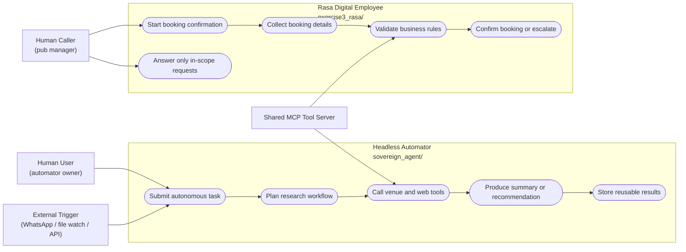

# Agent Use Cases (Mermaid-Compatible)

Mermaid does not support native UML `usecaseDiagram` syntax, so this file uses
a `flowchart` to represent the same actors, system boundaries, and use cases.

This diagram places the two bots as separate system boundaries:

- `Headless Automator` = `sovereign_agent/`
- `Rasa Digital Employee` = `exercise3_rasa/`

The human users are outside those boundaries as actors.

