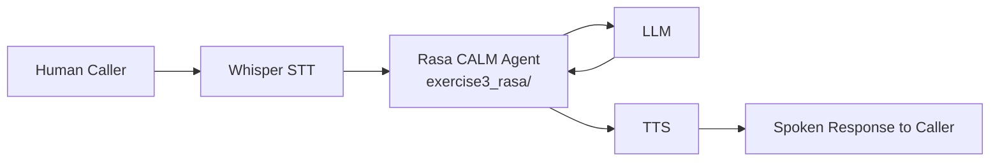

# Week 5 Voice Flow (UML)

This diagram isolates the voice-capable interaction path planned for the
Rasa Digital Employee track.

```mermaid
flowchart LR

A[Human Caller] --> B[Whisper STT]
B --> C[Rasa CALM Agent<br/>exercise3_rasa/]
C --> D[LLM]
D --> C
C --> E[TTS]
E --> F[Spoken Response to Caller]
```
